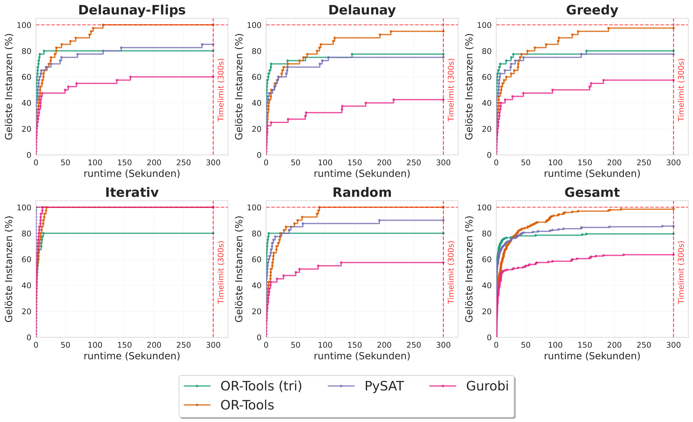

# Task

Gegeben ist eine Menge von Knoten, wobei jedem Knoten ein Grad, also die Anzahl der anliegenden Kanten, vorgegeben ist. Ziel ist es zu entscheiden, ob eine Triangulierung möglich ist. Wenn eine gültige Lösung existiert, wird sie als Kantenmenge ausgegeben.

# Solver

Für die Berechnung werden verschiedene Solver eingesetzt, die auf ähnlichen Grundideen beruhen, aber unterschiedliche Modellierungsansätze und Suchstrategien verwenden. CP-Sat und Gurobi nutzen dabei eine sehr ähnliche lineare Programmierung (LP)-Formulierung, während PySAT eine SAT-basierte Formulierung verwendet.

Neben den unterschiedlichen Solvern werden für jeden Ansatz zwei Varianten untersucht, eine Formulierung auf Kantenbasis und eine Formulierung auf Dreiecksbasis. Die Kantenformulierung modelliert die Auswahl einzelner Kanten direkt, während die Dreiecksformulierung die zulässigen lokalen Strukturen über Triangulierungsdreiecke beschreibt. Dadurch kann untersucht werden, welche Formulierung für bestimmte Instanzklassen deutlich besser geeignet ist.

Zusätzlich wurde ein eigener Propagator für CDCL entwickelt, um zu testen, welche Verbesserungen durch eine speziell angepasste Propagationsstrategie erzielt werden können.

# Programm aufbau

Das Projekt ist in mehrere Komponenten gegliedert. Der Input Generator erzeugt Testinstanzen mit vorgegebenen Gradbedingungen. Anschließend werden diese Instanzen mit unterschiedlichen Solver-Varianten bearbeitet. Die Ergebnisse werden anschließend ausgewertet und in einer geeigneten Form visualisiert.

Damit entsteht ein durchgängiger Ablauf von der Erzeugung der Probleminstanzen über die Lösungssuche bis zur Ausgabe und Analyse der Ergebnisse. Zusätzlich gibt es verschiedene Evaluationen, in denen Parameter für Input, Solver und Auswertung gezielt variiert werden, um systematische Vergleiche zu ermöglichen.

# Results

Eine beispielhafte Ausgabe einer Evaluation ist in der folgenden Grafik dargestellt:



Die Abbildung zeigt die Laufzeiten verschiedener Solver-Konfigurationen und erlaubt einen Vergleich der jeweiligen Ansätze unter identischen beziehungsweise ähnlichen Testbedingungen.

Im Folgenden ist eine beispielhafte Darstellung der Ausgabe der Parameter zu sehen die zusammen mit dem Graphen erzeugt würden.
```
Args Legend Mapping (by Solver):
==================================================

SAT:
|#1 in 300s: 
||solver_name:                        Glucose42
||add_allEdges_or_exclude_edges:      True
||number_edges:                       False
||intersection:                       True
||all_edges:                          False
||degree_exact:                       False
||degree_atleast:                     True
||degree_encoding:                    1
||degree_subset:                      False
||fix_hull:                           False
||exclude_edges:                      False
||hack_eval6:                         False
||fix_edges:                          True
||run_num:                            0


gurobi:
|#1 in 300s: 
||intersection:                       True
||degree:                             True
||exclude_edges:                      False
||fix_hull:                           False
||all_edges:                          False
||fix_edges:                          True
||run_num:                            0


Ortools:
|#1 in 300s: 
||intersection:                       True
||all_edges:                          True
||degree:                             True
||fix_hull:                           True
||number_edges:                       False
||evaluation_direction:               False
||save_state_after_solution:          False
||min_max_direction:                  False
||maximize_edges:                     False
||exclude_edges:                      False
||fix_edges:                          True
||run_num:                            0


OrTools_tri:
|#1 in 300s: 
||intersection:                       True
||degree:                             True
||exclude_edges:                      False
==================================================`
```